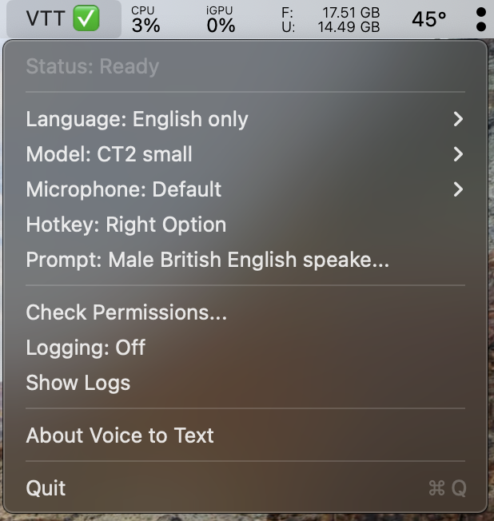
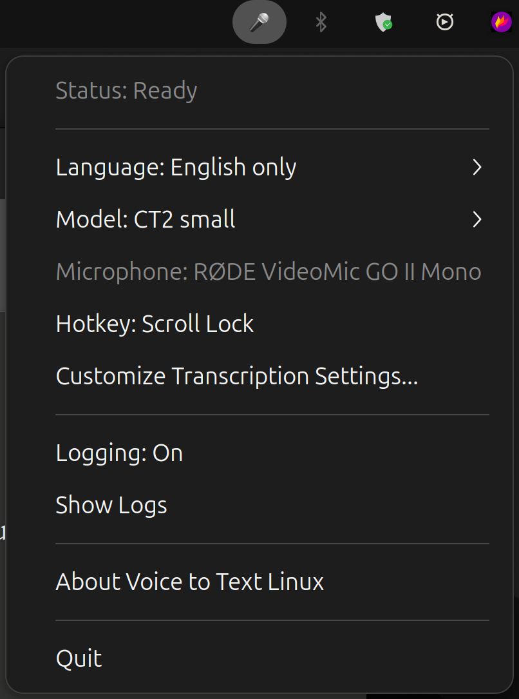
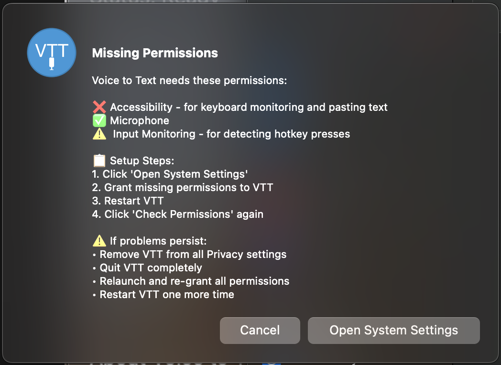
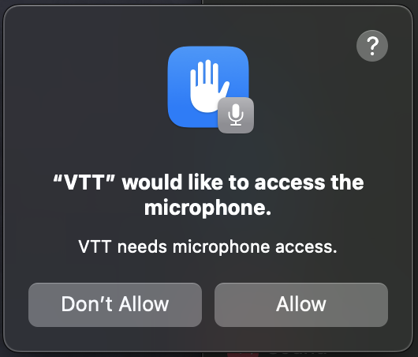
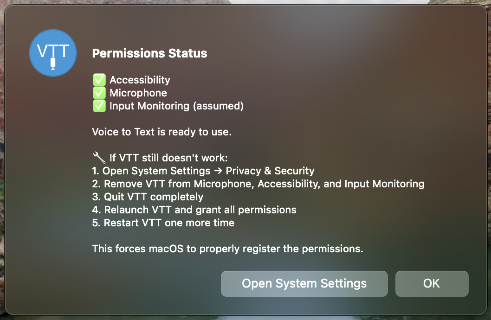

# Voice to Text

Local push-to-talk voice transcription using OpenAI Whisper.

[](https://github.com/powell-clark/voice-to-text)
[](https://github.com/powell-clark/voice-to-text)
[](LICENSE)

**100% offline. No cloud. No subscriptions.**

---

## Install

### macOS

```bash
brew tap powell-clark/voice-to-text
brew install --cask voice-to-text
```

### Linux

```bash
sudo add-apt-repository ppa:powellclark/voice-to-text
sudo apt update && sudo apt install voice-to-text
```

That's it. Hold **Scroll Lock** and speak.

---

## Usage

**macOS:** Hold **Right Alt** + speak

**Linux:** Hold **Scroll Lock** + speak (customizable from tray menu)

Text appears instantly in any application - Slack, Terminal, VS Code, browsers, email, anywhere you can type.

<details>
<summary>View menu screenshots</summary>

<p align="center">
  
  
</p>

</details>

---

## Features

### 🎯 Core
- **Push-to-talk recording** - Hold key, speak, release
- **Instant transcription** - Text types into your active app
- **100% offline** - No internet, no cloud, no tracking
- **Menu/tray integration** - Configure without opening an app

### 🚀 Performance
- **Multiple models** - Balance speed vs accuracy (tiny to large-v3)
- **GPU acceleration** - 5-10x faster with NVIDIA CUDA
- **Two backends** - whisper.cpp (lightweight) or faster-whisper (fast)
- **Optimized English mode** - Uses .en models for better speed

### 🌍 Languages
- **English-only mode** - Fastest, uses optimized models
- **99+ languages** - Auto-detects Chinese, Spanish, French, German, Japanese, Arabic, and more

---

## Configuration

Click the menu/tray icon to adjust:

| Setting | Options | Default |
|---------|---------|---------|
| **Model** | tiny / base / **small** / medium / large-v3 | small |
| **Backend** | whisper.cpp (W) / faster-whisper (CT2) | CT2 |
| **Language** | English-only / Multilingual | English-only |
| **Microphone** | System input devices | Default |
| **Hotkey (Linux)** | Customize recording key | Scroll Lock |

### Model Comparison

| Model | Size | Speed | Use Case |
|-------|------|-------|----------|
| **tiny** | 39 MB | ⚡⚡⚡⚡⚡ | Testing |
| **base** | 74 MB | ⚡⚡⚡⚡ | Simple dictation |
| **small** | 244 MB | ⚡⚡⚡ | **Recommended - best balance** |
| **medium** | 769 MB | ⚡⚡ | Higher accuracy |
| **large-v3** | 1.5 GB | ⚡ | Maximum accuracy |

**Recommendation:** Start with **CT2 small** in **English-only mode**. Add GPU acceleration if you have NVIDIA hardware.

---

## Advanced Setup

### GPU Acceleration (Linux)

For 5-10x faster transcription with NVIDIA GPUs:

```bash
# Install CUDA 12.6
sudo apt install cuda-toolkit-12-6 libcudnn9-cuda-12

# Add to ~/.bashrc
export PATH=/usr/local/cuda-12.6/bin:$PATH
export LD_LIBRARY_PATH=/usr/local/cuda-12.6/lib64:$LD_LIBRARY_PATH

# Restart service
systemctl --user restart vtt
```

Verify: `python3.12 -c "import ctranslate2; print(ctranslate2.get_cuda_device_count())"`

### Service Management (Linux)

```bash
# Start/stop/restart
systemctl --user start vtt
systemctl --user stop vtt
systemctl --user restart vtt

# View logs
journalctl --user -u vtt -f
tail -f ~/.local/share/voice-to-text/vtt.log

# Disable auto-start
systemctl --user disable vtt
```

---

## Build From Source

### macOS

**Requirements:** macOS 11.0+, Xcode Command Line Tools

```bash
git clone https://github.com/powell-clark/voice-to-text.git
cd voice-to-text

# Install dependencies
brew install cmake portaudio

# Build
make vendor-whisper
make whisper-lib
make complete

# Run or install
open VTT.app
# OR: cp -R VTT.app /Applications/
```

### Linux

**Requirements:** Ubuntu 24.04+, GCC 11+, Python 3.12+

```bash
git clone https://github.com/powell-clark/voice-to-text.git
cd voice-to-text

# Install dependencies
sudo apt install build-essential pkg-config portaudio19-dev \
  libx11-dev libxtst-dev libxext-dev libgtk-3-dev \
  libayatana-appindicator3-dev libnotify-dev \
  python3.12 python3-pip

# Install Python backend
python3.12 -m pip install --break-system-packages faster-whisper ctranslate2

# Build
make -f Makefile.linux
./vtt-linux
```

---

## Troubleshooting

### macOS

**First-time setup: Grant permissions**

On first run, macOS requires permissions for microphone, accessibility, and input monitoring. Click "Check Permissions..." from the menu bar icon:

<details>
<summary>View permission setup steps</summary>

1. Click "Open System Settings" when prompted:

   

2. Allow microphone access:

   

3. Verify all permissions are enabled:

   

</details>

**Permissions not working**
- System Settings → Privacy & Security
- Remove VTT from Microphone, Accessibility, and Input Monitoring
- Re-add by launching VTT and clicking "Check Permissions..."
- Restart the app

**No transcription**
- Enable logging from the menu icon
- Check logs: `log stream --predicate 'process == "VTT"'`
- Try switching to CT2 small model

### Linux

**Hotkey not working**
- Verify X11 (not Wayland): `echo $XDG_SESSION_TYPE`
- Must return `x11` - Wayland support coming soon
- Check logs: `tail -f ~/.local/share/voice-to-text/vtt.log`
- Try customizing hotkey from tray menu

**No system tray icon**
- Install AppIndicator: `sudo apt install libayatana-appindicator3-1`
- Check service: `systemctl --user status vtt`
- GNOME users need the [AppIndicator extension](https://extensions.gnome.org/extension/615/appindicator-support/)

**GPU not detected**
- Check CUDA: `nvcc --version`
- Test: `python3.12 -c "import ctranslate2; print(ctranslate2.get_cuda_device_count())"`
- Restart after installing CUDA: `systemctl --user restart vtt`

**Microphone issues**
- List devices: `pactl list sources short`
- Test: `arecord -d 3 test.wav && aplay test.wav`
- Select different mic from tray menu

---

## Architecture

```
src/
├── common/              # Cross-platform shared code
│   ├── logging.c/h     # Debug logging
│   ├── queue.c/h       # Audio buffer management
│   ├── settings.c/h    # Configuration handling
│   └── transcribe.py   # Python transcription backend
├── macos/              # macOS implementation
│   └── VTTDaemon.m     # Menu bar app + daemon
└── linux/              # Linux implementation
    ├── audio.c         # PortAudio recording
    ├── keyboard.c      # X11 global hotkey hook
    ├── typing.c        # XTest text injection
    └── gui.c           # GTK3 system tray
```

**Tech Stack:**
- **Audio:** PortAudio (cross-platform recording)
- **Transcription:** whisper.cpp (C++) or faster-whisper (Python)
- **Models:** OpenAI Whisper (tiny/base/small/medium/large-v3)
- **UI:** macOS Cocoa / Linux GTK3
- **Input:** X11 XTest (Linux) / Accessibility API (macOS)

---

## Contributing

Pull requests welcome. Use [conventional commits](https://www.conventionalcommits.org/):

```
feat: Add real-time streaming transcription
fix: Resolve microphone detection on Ubuntu 24.10
docs: Update GPU installation guide
chore: Bump whisper.cpp to v1.5.4
```

### Ideas for Contributions

**Features:**
- Custom hotkey combinations (e.g., Cmd+Shift+Space)
- Transcription history viewer
- Real-time streaming (transcribe while speaking)
- Windows/iOS/Android ports

**Improvements:**
- Voice activity detection (auto-stop recording)
- Smaller model downloads (quantization)
- Wayland support (replace X11)

**Documentation:**
- Video tutorials
- Performance benchmarks
- Integration guides (Vim, VS Code plugins)

---

## Roadmap

- [ ] **Windows support** - Native Win32 implementation
- [ ] **Wayland support** - Replace X11 on Linux
- [ ] **Streaming transcription** - Real-time as you speak
- [ ] **Custom wake words** - "Computer, write this..."
- [ ] **Model compression** - Smaller downloads via quantization
- [ ] **Auto-punctuation** - Smart capitalization and punctuation

---

## Credits

Built with:
- [whisper.cpp](https://github.com/ggerganov/whisper.cpp) by Georgi Gerganov
- [faster-whisper](https://github.com/guillaumekln/faster-whisper) by Guillaume Klein
- [CTranslate2](https://github.com/OpenNMT/CTranslate2) by OpenNMT
- [OpenAI Whisper](https://github.com/openai/whisper) models

---

## License

Apache License 2.0 • Copyright © 2025 Powell-Clark Limited

See [LICENSE](LICENSE) for details.

---

**Made with ❤️ for developers, writers, and anyone tired of typing.**

⭐ Star this repo if it saved your wrists
